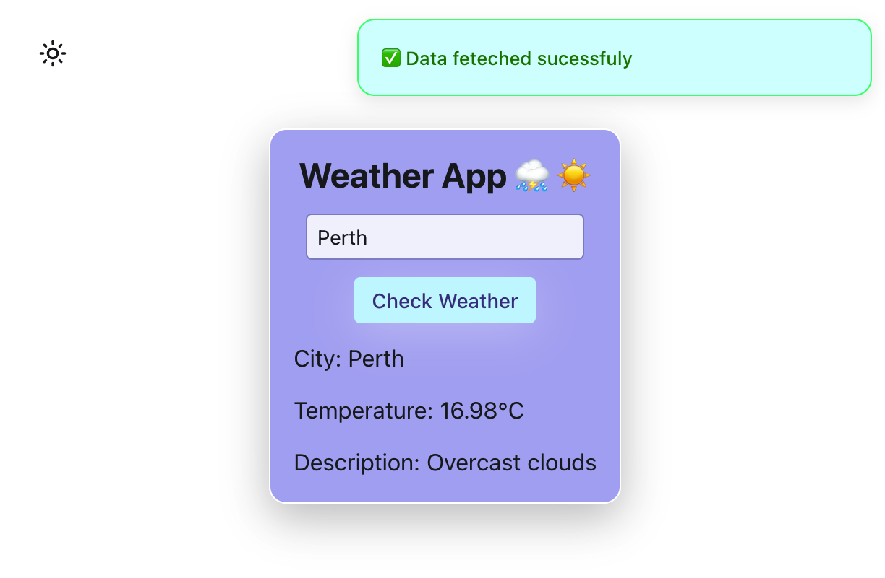

# Reflex Weather App ⛅

A simple, elegant weather application built with **[Reflex](https://reflex.dev)** (a full-stack Python framework for building web apps entirely in Python). Built for educational purposes.

The app allows users to enter a city name and instantly retrieve current weather information powered by the **[OpenWeatherMap API](https://openweathermap.org/)**, including temperature in Celsius and weather description. It features a clean, responsive UI with light/dark mode support and real-time toast notifications.

## Features

- Fully written in **pure Python** — no JavaScript required
- Asynchronous API calls using `aiohttp`
- Real-time reactive state management with Reflex
- Light/Dark mode toggle
- Custom styled toast notifications on successful fetch
- Error handling for invalid cities, network issues, or API errors
- Responsive and visually appealing centered layout

## Code Highlights

- Uses `rx.State` for reactive state management
- Asynchronous weather fetching via`aiohttp`
- Conditional rendering with `rx.cond`
- Color mode-aware styling using `rx.color_mode_cond`
- Toast notification on successful data retrieval


## Preview

  
*(Actual appearance adapts to system light/dark mode)*

## Requirements

- Python 3.8+
- Reflex ≥ 0.3.0
- `aiohttp`
- `python-dotenv`

## Installation

1. Clone or download this project:

```bash
git clone https://github.com/tpreisig/weather-box
cd reflex-weather-app
```

2. Create a virtual environment (recommended)

```bash
python -m venv .venv
source .venv/bin/activate  # On Windows: venv\Scripts\activate
```

3. Install dependencies

```bash
pyhton -m pip install reflex aiohttp python-dotenv
```

4. Get a fee API key from **[OpenWeatherMap](https://openweathermap.org/)**

## Running the App

```bash
reflex run
```

The app will start at `http://localhost:3000` (frontend) and `http://localhost:8000` (backend).
